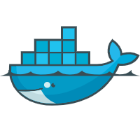
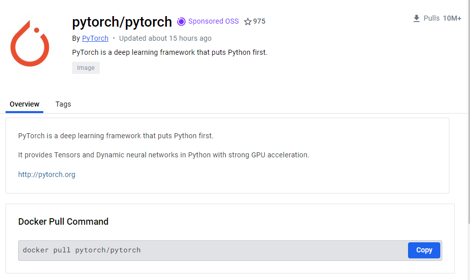
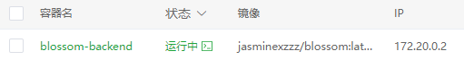
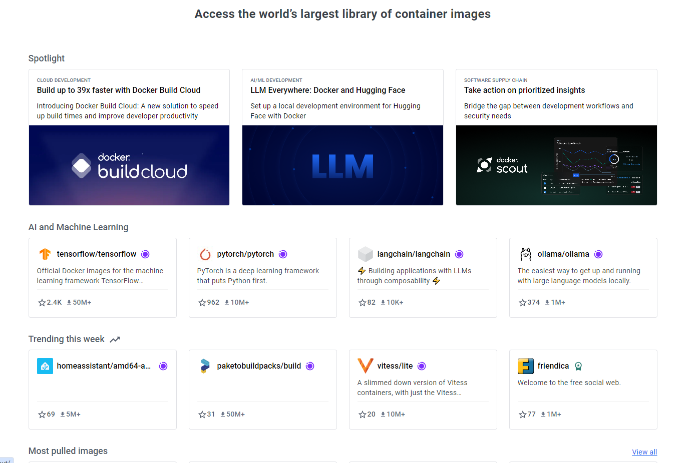
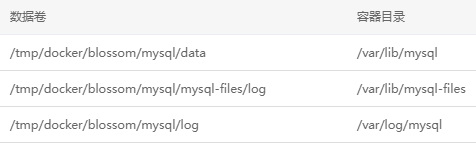
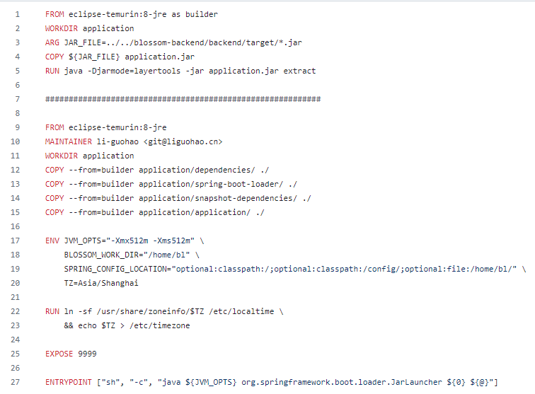

# 和Dcker打个招呼

[Docker官方文档](https://docs.docker.com/)

[Docker官方博客](https://www.docker.com/blog/)

## 了解[Docker](https://baike.baidu.com/item/Docker?fromModule=lemma_search-box)

Docker 是一个开源的应用容器引擎，它允许开发者打包他们的应用以及应用的运行环境到一个可移植的容器中。
>
容器是一个标准化的软件单元，它包含了运行应用程序所需的代码、运行时、系统工具、库和设置。`Docker` 使用 `Linux` 内核的资源隔离特性（如 [cgroup](https://baike.baidu.com/item/Cgroup/4988200?fr=ge_ala) 和 `namespace`）来运行多个容器，使得每个容器都在一个独立的环境中运行，但占用的资源较少，启动速度也非常快。

### 相较于[虚拟机](https://baike.baidu.com/item/%E8%99%9A%E6%8B%9F%E6%9C%BA?fromModule=lemma_search-box)

 

#### 1. 技术架构

虚拟机(`Virtual Machine`): 
&emsp;&emsp; 每个虚拟机都运行在完全隔离的环境中，并且包括了它自己的完整操作系统副本。虚拟机是通过在物理硬件上运行一个称为“虚拟机监控器”（[Hypervisor](https://baike.baidu.com/item/%E8%99%9A%E6%8B%9F%E6%9C%BA%E7%9B%91%E8%A7%86%E5%99%A8?fromtitle=hypervisor&fromid=3353492&fromModule=lemma_search-box)）的软件来实现的，它负责在物理服务器和多个虚拟机之间分配资源。

`Docker`: 
&emsp;&emsp; 容器与虚拟机不同，容器共享宿主机的操作系统内核，不需要虚拟出硬件，不需要运行完整的操作系统镜像。

#### 2. 性能

虚拟机: 
&emsp;&emsp; 由于每个虚拟机都需要运行完整的操作系统，因此它们通常需要更多的系统资源（`CPU`、内存、存储，资源的分配有一定的静态性和限制。虚拟机的启动时间相对较长。

`Docker`: 
&emsp;&emsp; 容器直接使用宿主机的操作系统，因此启动时间快，资源消耗低。这使得在相同的硬件上可以运行更多的容器实例，资源利用率更高。

#### 3. 隔离部署

虚拟机: 
&emsp;&emsp; 每个虚拟机都有自己的操作系统实例，具有非常高的隔离级别，适用于需要强隔离的应用程序。另外，通常手动部署虚拟机会设计复杂的安装和配置过程。

`Docker`: 
&emsp;&emsp; 提供进程级别的隔离，在用户空间中运行在隔离环境下，虽然不如虚拟机隔离彻底，但大多数情况下满足要求。部署快速且一致，支持更高的部署密度

### 基本概念

#### 1. 镜像（`Image`）

`Docker`镜像是一个只读的模板，包含了运行容器所需的代码、库、环境变量和配置文件。镜像用于创建Docker容器，`Docker`用户可以使用自己的镜像仓库或者从[Docker Hub](https://hub.docker.com/)等公共镜像仓库中下载别人创建的镜像来启动容器。

例子：

#### 2. 容器（`Container`）

容器是镜像的运行实例。当你从一个镜像启动时，实际上正在运行一个容器。容器是隔离的、安全的，并且可以控制其运行环境和所需资源。容器可以启动、开始、停止、移动和删除。每个容器都是从一个镜像构建出来的，可以在其基础上进行额外的修改和设置。

#### 3. 仓库（`Repository`）
`Docker`仓库用于存放镜像。[Docker Hub](https://hub.docker.com/)是`Docker`的官方公共仓库，用户可以从中拉取（`pull`）镜像到本地环境，或者将自己创建的镜像推送（`push`~~误入`Git`~~）到`Docker Hub`。除了`Docker Hub`，用户还可以使用私有仓库。

#### 4. 数据卷（`Volume`）
由于容器的文件系统是临时的，当容器删除时，存储在容器内的数据也会丢失。为了持久化或共享数据，`Docker`使用数据卷。数据卷是独立于容器生命周期之外的目录或文件，可以被挂载到容器内部。

#### 5. `Dockerfile`
`Dockerfile`是一个文本文件，包含了一系列的指令，用于自动构建一个`Docker`镜像。`Dockerfile`定义了从基础镜像开始，如何一步步构建新镜像，添加代码、库、环境变量等

#### 6. `Docker Compose`
`Docker Compose`是一个用于定义和运行多容器`Docker`应用程序的工具。可以使用一个`YAML`文件来配置`Docker`容器，然后创建和启动这些容器。
