# `Docker`实践

> 注： 本教程 maybe need magic！

## 借助`Koyeb`部署`Docker`应用

>&nbsp;&nbsp;`Koyeb`是一个致力于简化应用部署和运维流程的无服务器平台，它通过提供全球部署、`Docker`容器支持、免运维服务以及友好的开发者体验，帮助用户快速、经济高效地将应用程序部署到云端，并根据需求自动扩展

`Koyeb`对每个用户提供了一定的免费资源，用以部署应用，接下来的部署实践应用是名为`Stirling-PDF`的一个开源在线`Pdf`工具箱(镜像名为`s-pdf`)

<a href="https://github.com/Stirling-Tools/Stirling-PDF" target="_blank">`Stirling-PDF`的Github源码地址</a>

<a href="https://hub.docker.com/r/frooodle/s-pdf" target="_blank">`s-pdf`公共镜像地址</a>

### 1. 登录/注册`Koyeb`账号

<a href="https://www.koyeb.com/" target="_blank">Koyeb站点</a>

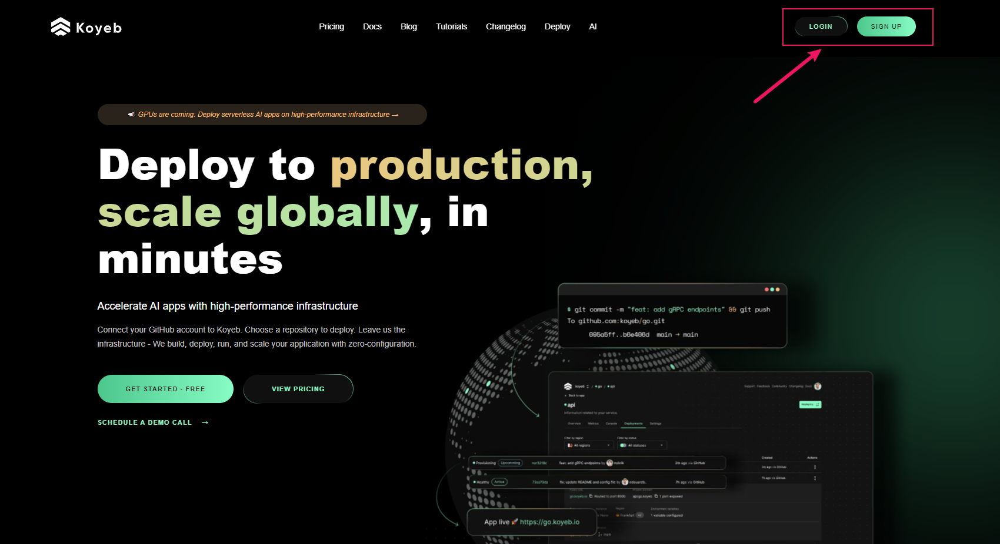

注册时可以使用`Email`或者`Github`绑定方式：

填写相关信息，这里`organization's name`是用户唯一的：

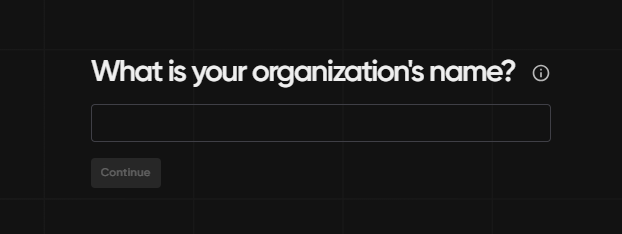

下面这一页可以随意填写：

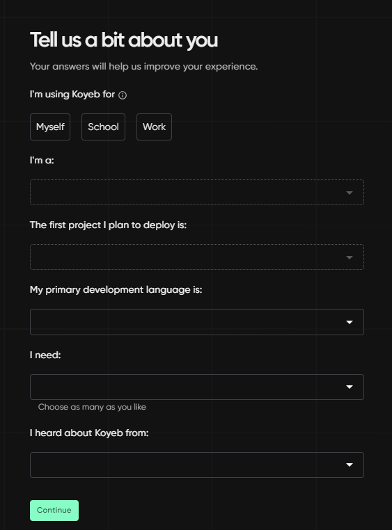

### 2. 创建容器应用并部署

选择部署`Docker`应用：

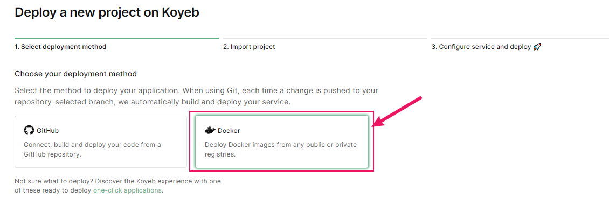

选择`Create Web Service`：

填入`s-pdf`的镜像地址:

这里配置一下容器，开放端口`8080`:

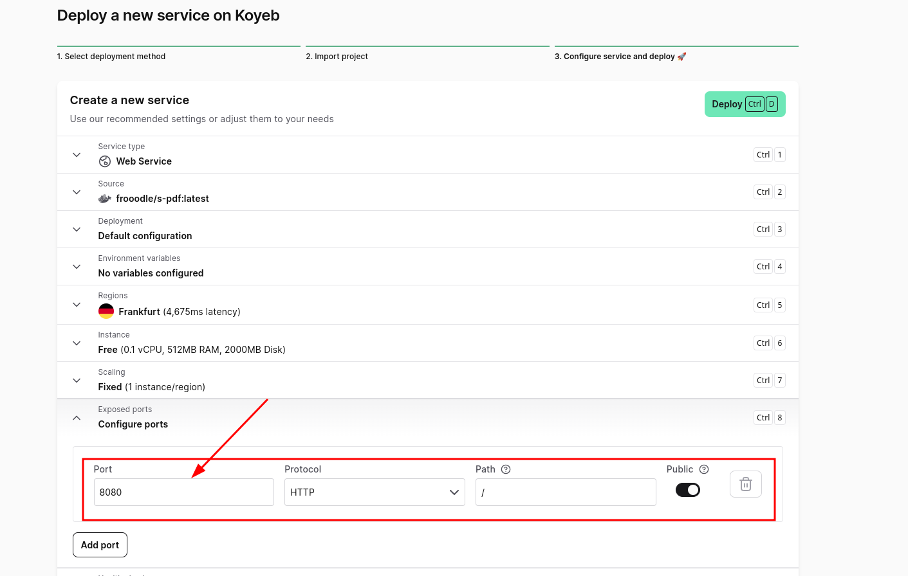

然后点击右上角`Deploy`即可自动部署

### 3. 访问应用

在我们对`Koyeb`的体验下，使用免费额度部署应用会比较慢，甚至可能需要等待`20`分钟~`50`分钟不能，这里耐心等待即可

如果服务状态出现`Error`，可以检查上述配置是否有问题，再重新部署一下:smile:

部署好之后应用状态应该是`healthy`的：

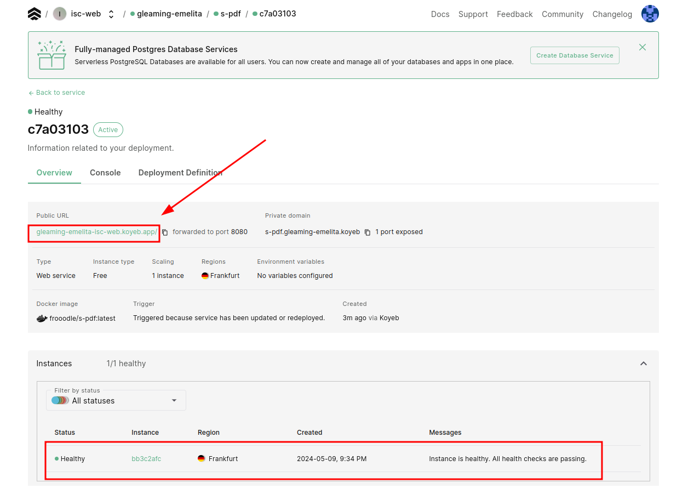

使用给出的`url`路径即可跳转访问使用(右上角有语言切换设置):

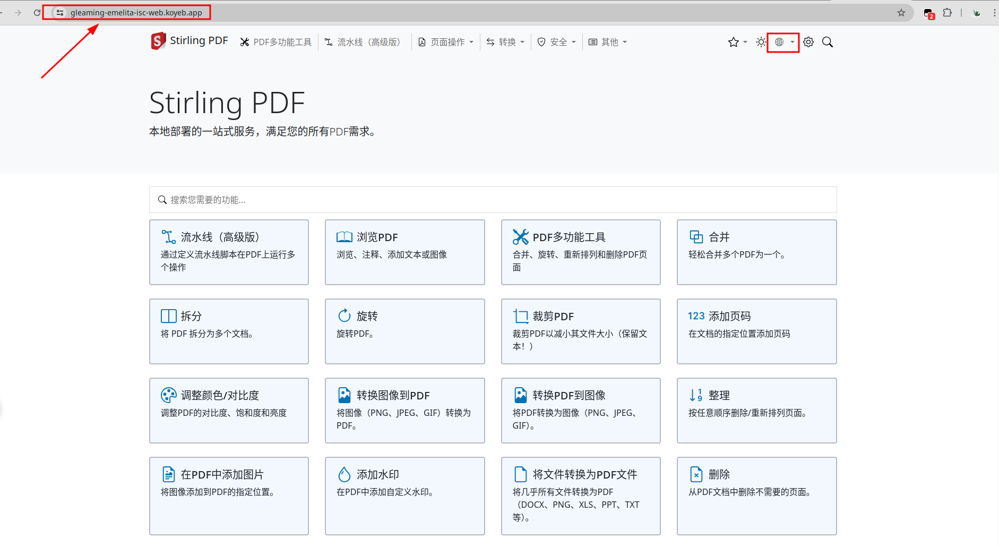

## 借助`Render`部署`Docker`应用

>&nbsp;&nbsp;Render作为一个云服务提供商，提供了一个统一的平台来构建和运行各种应用程序和网站。这个平台的特点包括免费的`TLS`证书、全球内容分发网络(`CDN`)、私有网络以及从`Git`自动部署等功能，帮助开发者更高效地管理和运行他们的在线项目。

在这个平台上我们将部署一个名为`it-tools`的在线工具箱

<a href="https://github.com/CorentinTh/it-tools" target="_blank">`it-tools`的Github源码地址</a>

<a href="https://hub.docker.com/r/corentinth/it-tools" target="_blank">`it-tools`公共镜像地址</a>

### 1. 登录/注册`Render`账号

[Render站点](https://render.com/)：

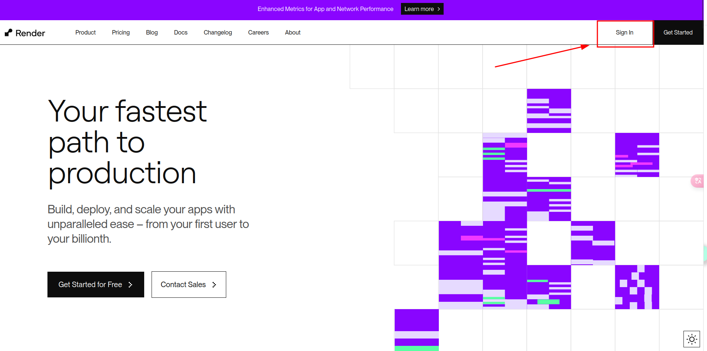

点击右上角进行注册，可以使用现有的其他平台账号比如`Github`绑定，就能自动识别到你的邮箱

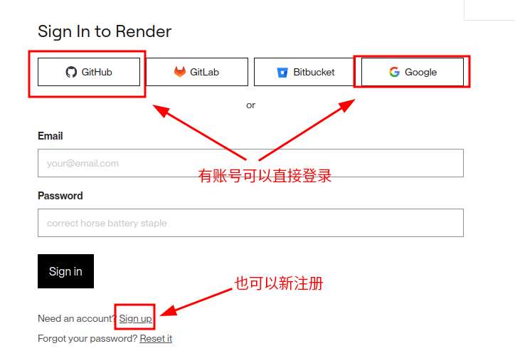

中途会有一个邮箱验证，收到邮件之后认证一下即可

### 2. 创建容器应用并部署

注册好之后选择新建`Web Service`：

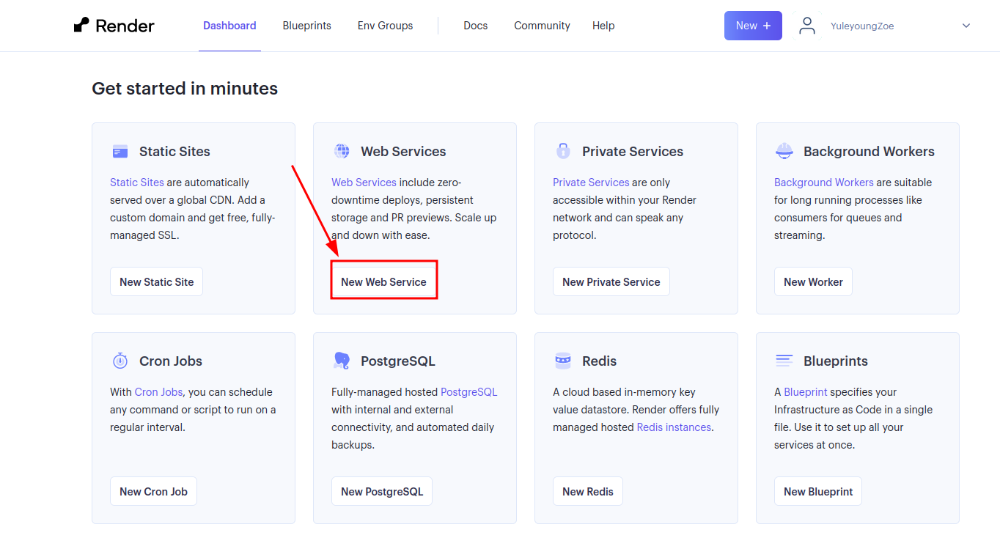

选择从现有的镜像创建：

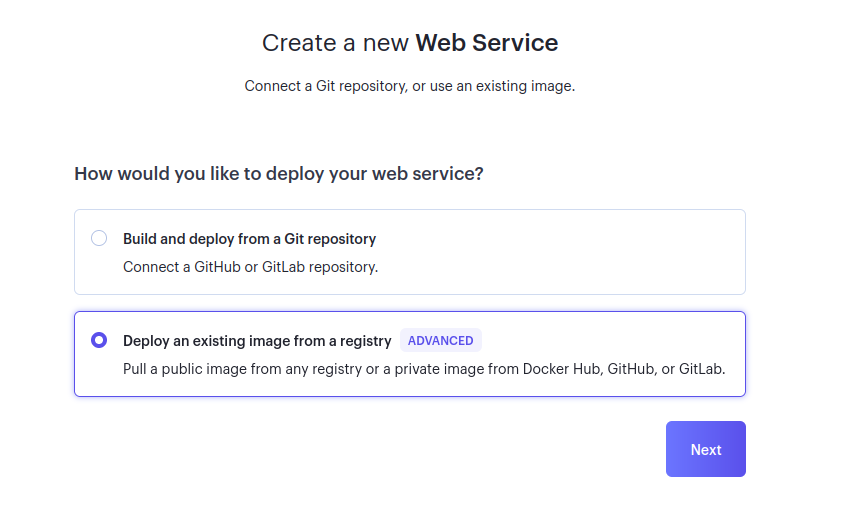

填入`it-tools`的镜像地址:

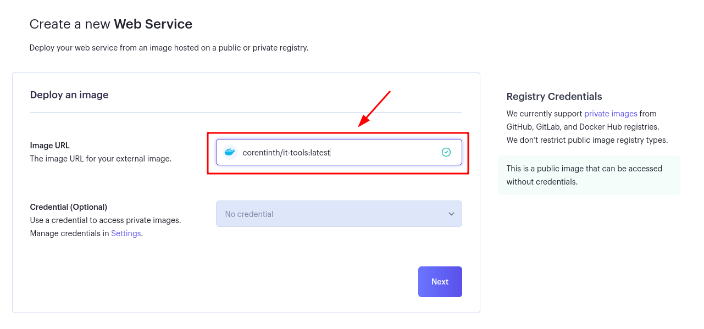

进行简单的设置，`Name`可以随意设置，`Region`建议设置为新加坡，同时设实例类型为`Free`：

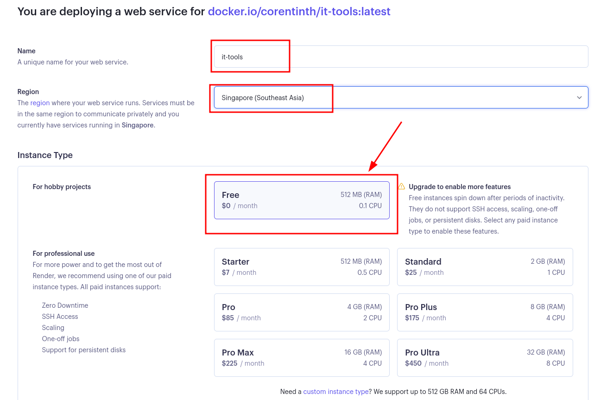

点击`Create Web Service`即可自动创建：

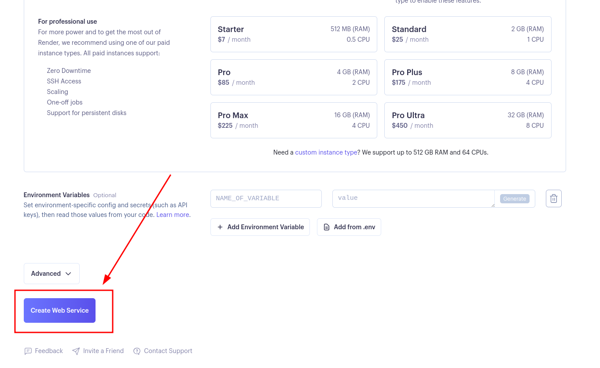

一般情况下在应用不多时`Render`构建服务较快，且成功标志为状态绿色`Live`

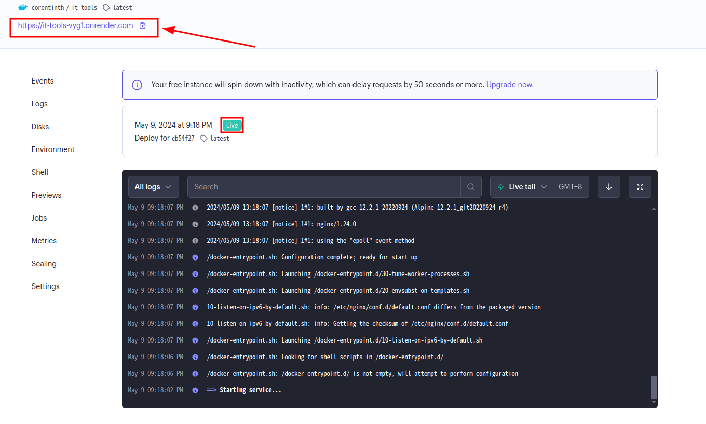

### 3.访问使用工具箱

同样使用给出的`url`即可成功访问使用：

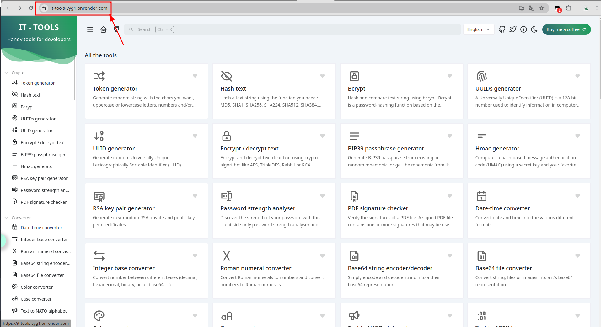

### 说明

安排这样的平台部署顺序我们是有意而为之，因为`Render`站点的免费额度有一定限制，有一点就是如果服务部署后，在每`15Min`内没有流量访问，后台就会自动将服务暂停，后续有访问时再重启服务，还有像一个月服务免费部署额度上线为`720Hour`(对，就是`30`天，即限制只能完整部署一个服务，详见[官方说明](https://docs.render.com/free#free-web-services))，所以就在此部署比较轻便的`it-tools`，即使挂了，重启也是比较快的；而像`Koyeb`就没有这种限制，只是单纯的配置低而已。所以，最好能有一个监控(比如[uptime-kuma](https://github.com/louislam/uptime-kuma))，定时对`Render`上的服务进行心跳检测和保活操作

## 小结语

- 如果有需求或者感兴趣的话，可以看看别的应用部署平台，国内国外有很多，价格有高有低，还请自行评估。

- 如果手上有服务器的话，也可以装装`Docker`，部署应用非常快、方便，数据迁移快捷

- 如果需要在`Windows`系统上安装`Docker`，可以自行查找教程，对于每个人设备不同，步骤和设置亦不一样

