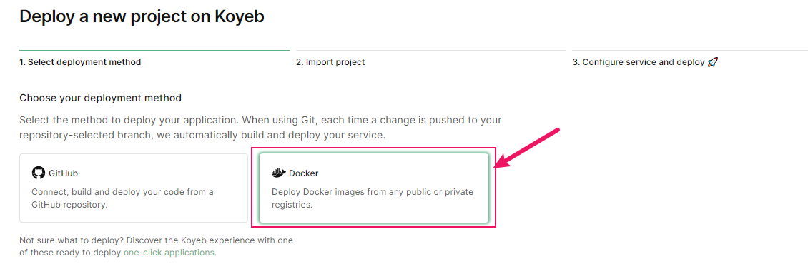
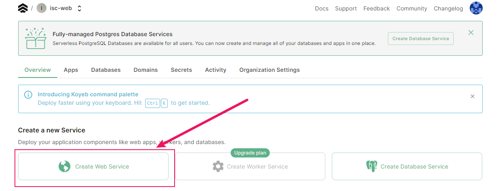
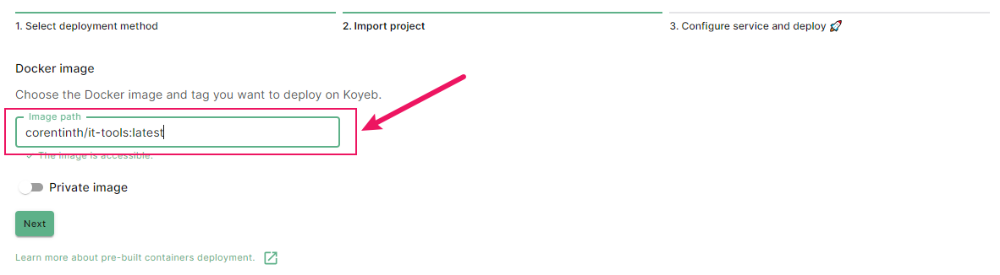
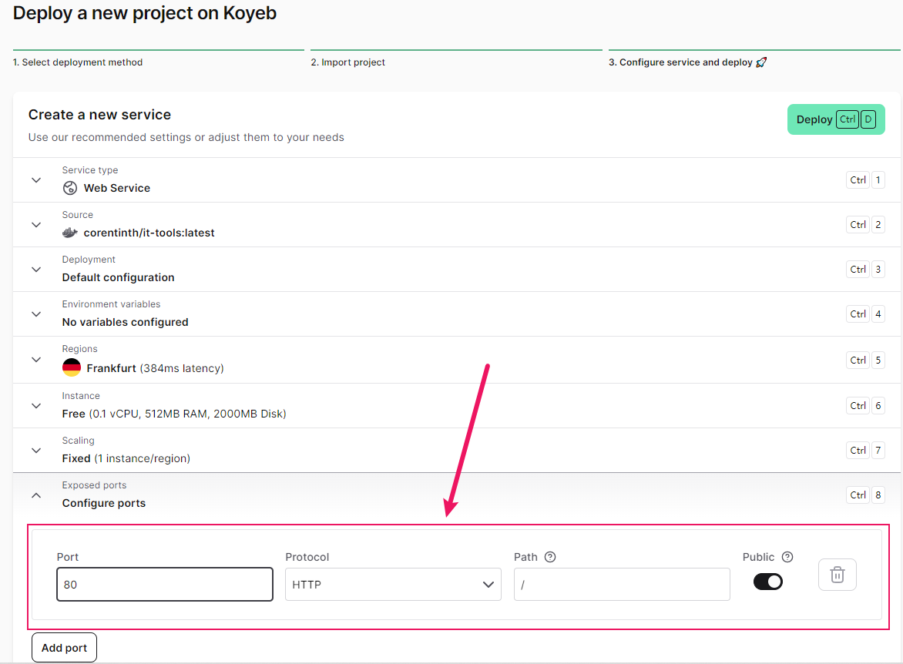
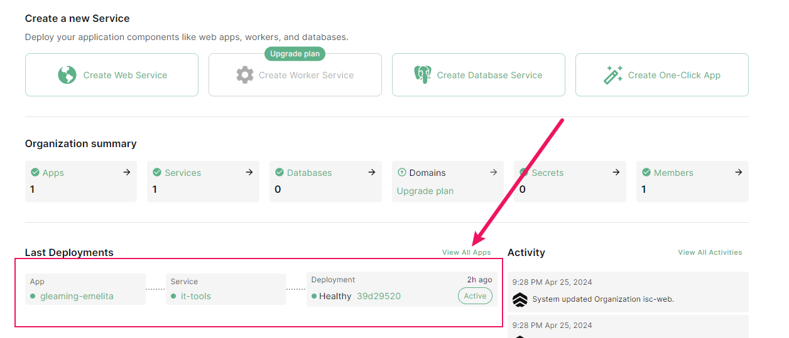
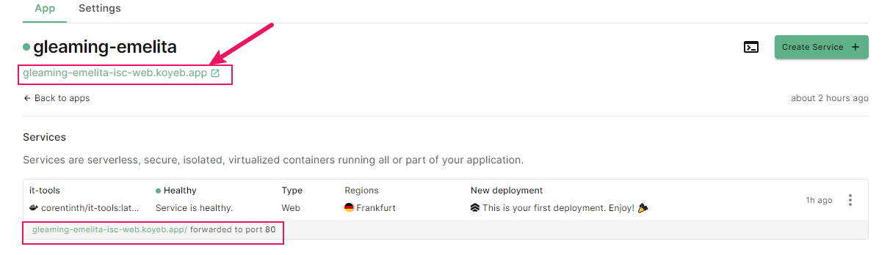
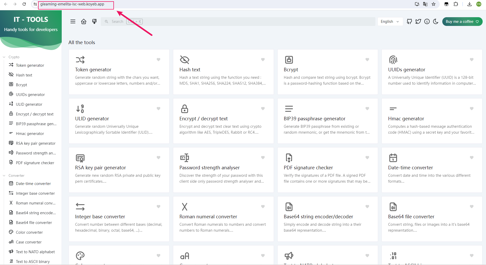

# `Docker`实践

## 借助`Koyeb`部署`Docker`应用

>`Koyeb`是一个致力于简化应用部署和运维流程的无服务器平台，它通过提供全球部署、`Docker`容器支持、免运维服务以及友好的开发者体验，帮助用户快速、经济高效地将应用程序部署到云端，并根据需求自动扩展

`Koyeb`对每个用户提供了一定的免费资源，用以部署应用，接下来的部署实践应用是名为`it-tools`的一个开源在线工具箱

<a href="https://github.com/CorentinTh/it-tools" target="_blank">it-tools的Github源码地址</a>

<a href="https://hub.docker.com/r/corentinth/it-tools" target="_blank">it-tools公共镜像地址</a>

### 1. 登录/注册账号

<a href="https://www.koyeb.com/" target="_blank">Koyeb站点</a>

注册时可以使用`Email`或者`Github`绑定方式

填写相关信息，这里`organization's name`是用户唯一的

下面这一页可以随意填写

### 2. 创建容器应用并部署

选择部署`Docker`应用

选择`Create Web Service`

填入`it-tools`的镜像地址

这里配置一下容器，开放端口`80`

然后点击右上角`Deploy`即可自动部署

### 3. 访问应用

在我们对`Koyeb`的体验下，使用免费额度部署应用会比较慢，甚至可能需要等待`30`分钟~一个小时，这里耐心等待即可

部署好之后应用状态应该是`healthy`的：

进入应用详情页:

访问使用工具箱:

### 小结语

- 如果有需求或者感兴趣的话，可以看看别的应用部署平台，国内国外有很多，价格有高有低，还请自行评估。

- 如果手上有服务器的话，也可以装装`Docker`，部署应用非常快、方便，数据迁移快捷

- 如果需要在`Windows`系统上安装`Docker`，可以自行查找教程，对于每个人设备不同，步骤和设置亦不一样

