# 搭建一个属于你自己的博客空间:stuck_out_tongue_winking_eye:

博客，你可以把它当做你的一片小天地，或者小众一丢丢的交友平台；你可以把你的学习笔记/生活感悟/以及所有可以放进日记本、朋友圈的东西上传到你的博客平台。简而言之，这是一个纯看个人兴趣爱好的小玩意儿:wink:

这里使用`Hexo`+`GitHub Page`搭建一个静态的博客站点，不需要服务器，完全免费

> but it maybe need magic

**注意**：下述步骤中任一步骤你自己已经完成，就不用**重复劳动**啦

## 环境准备

考虑到大家基本都是使用`windows`环境，所以就默认在`win`系统下进行操作

### Git

#### 1. 下载
- 可以选择从俱乐部网站上下载 : [Git](https://www.xdu-inspur.club/Files/Git-for-windows.exe)
- 也可以自己去`Git`官网 : [下载站点](https://git-scm.com/download/win)

#### 2. 安装
一直点`Next`就好了:

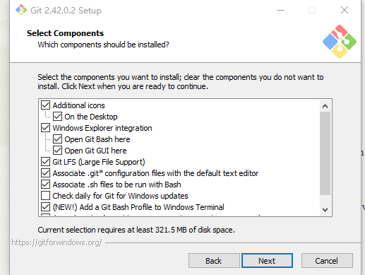

像这样：

 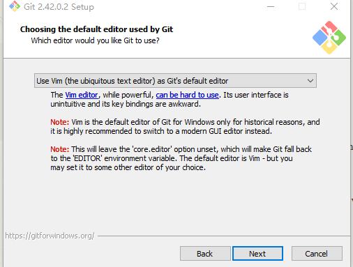 

#### 3. 检验是否安装成功
任何地方点击右键出现`Git Bash`即安装成功：

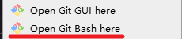 

### Node.js

同理，步骤基本差不多

#### 1. 下载

- 俱乐部网站 ： [Node.js](https://www.xdu-inspur.club/Files/nodejs.msi)
- `Nodejs`官网 : [下载站点](https://nodejs.org/en/download)

#### 2. 安装
注意安装时选择**添加到环境变量**，即`Add to Path`：

 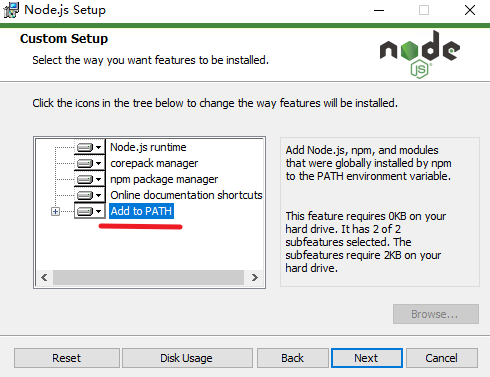 

#### 3. 检查
键盘点击`win`+`R`打开运行，输入`cmd`并回车打开终端，输入`node -v`和`npm -v`，均显示版本号即安装成功

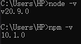

## 正式开始

### 注册一个GitHub账号

前往[GitHub](https://github.com/)(~~全球最大同性交友平台~~)，注册属于你自己的一个账号

**注意**：保存好你的**用户名**、**密码**以及**邮箱**


注册成功后你的`GitHub`主页(初始头像随机生成) ：

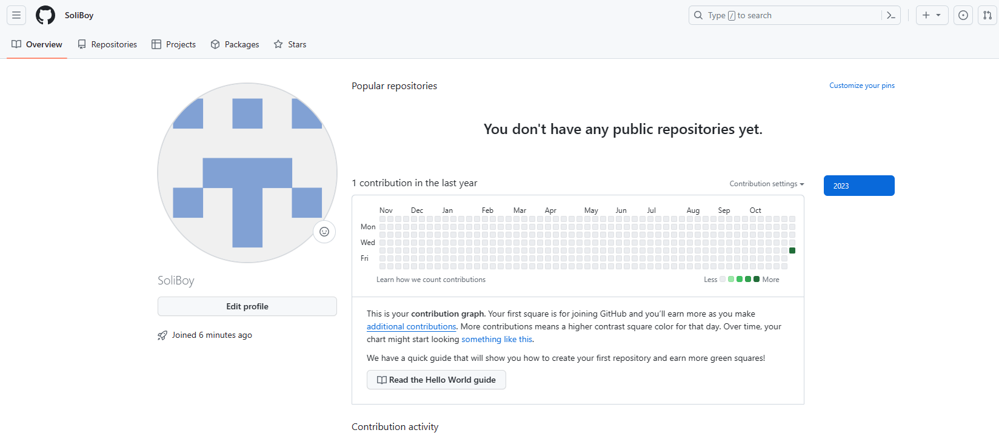 

### 创建存放博客页面的代码仓库

在`Repositories`页面新建一个名为 `你的用户名.github.io` 的仓库，**注意使用你自己GitHub账户的用户名**

示例：

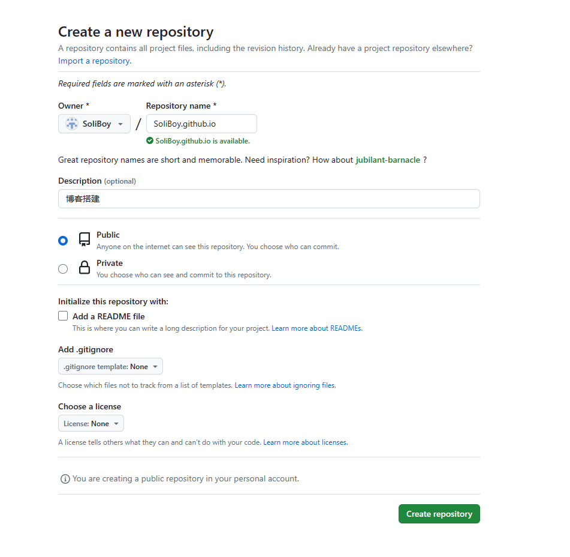 

### 本地Git配置

在电脑任何位置(我这里是桌面)，右键打开`Git Bash`，输入：
```shell
git config --global user.name "你注册的用户名"
```
```shell
git config --global user.email "你注册的邮箱"
```
**注意是你自己的用户名和邮箱**，而且""是有的

再输入：
```shell
git config --global --list
```
即可查看刚刚的配置信息

示例：

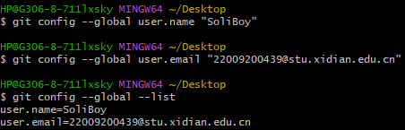 

### 使用SSH链接到远程GitHub

继续使用刚刚的窗口，输入：
```shell
ssh-keygen -t rsa -C "你的邮箱" #邮箱同上
```
然后一直回车：

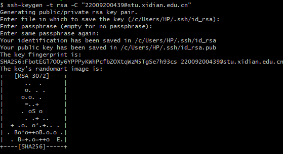

接着输入：
```shell
cd ~/.ssh #进入.ssh目录
```
```shell
ls #查看当前文件下文件
```
```shell
cat id_rsa.pub #将目标文件的内容输出
```

 

再复制公钥(圈出来的部分)，**注意从`ssh-rsa`开始到`邮箱号`结束都是**

然后，去到`GitHub`上，打开`Settings`，再进到`SSH and GPG keys`中，新建一个`SSH key`
 
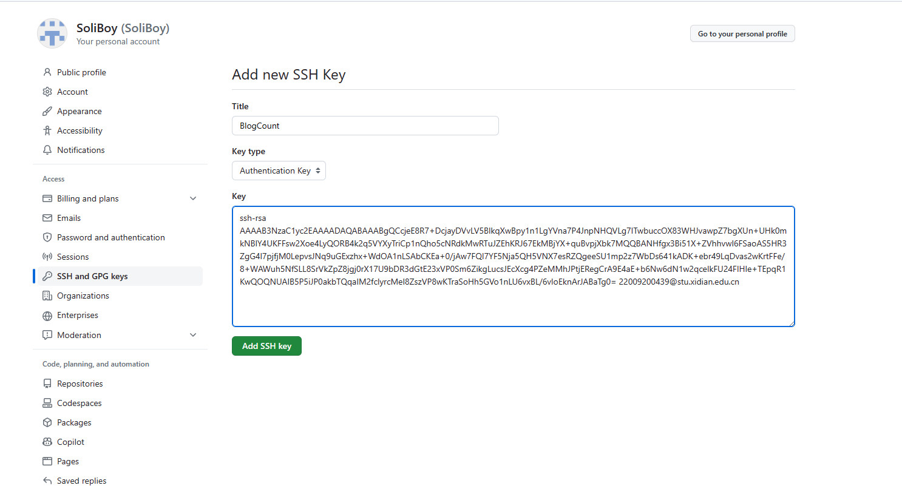

这里名字任取，内容即刚刚复制的公钥，点击`Add SSH key`即添加完成

再切回我们的`Git Bash`窗口，输入：
```shell
ssh -T git@github.com
```
出现以下提示即`SSH`连接成功：

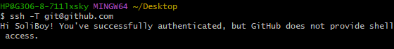 

在`Git Bash`中输入`exit`即可退出窗口了

### 安装Hexo
打开终端，输入：
```shell
npm install -g hexo-cli
```
即可安装`Hexo`，没有报错即安装成功；且你输入`hexo`应当会出现相关信息：

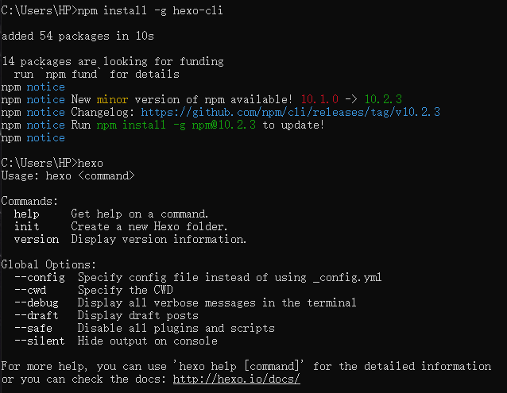 

**注**：同样，在终端窗口输入`exit`即可关闭

### 新建Hexo项目

选择一个工作文件夹(你会长期使用并且打开方便的位置)，新建一个文件夹用来存放博客文件，进入这个文件夹并打开一个新的`Git Bash`窗口，输入:
```shell
hexo init
```
没有报错即创建`Hexo`博客仓库成功

接着输入
```shell
hexo g #生成静态页面
```
```shell
hexo s #本地预览
```
窗口中会输出一个本地可预览的地址 ：

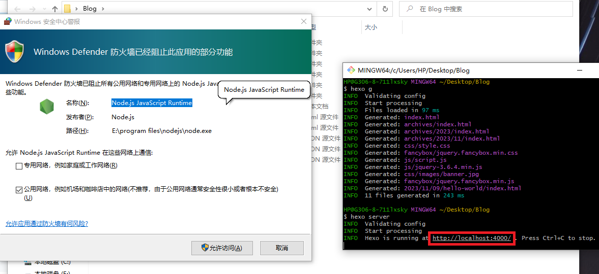 

复制在浏览器中打开，即可看到博客页面 ：

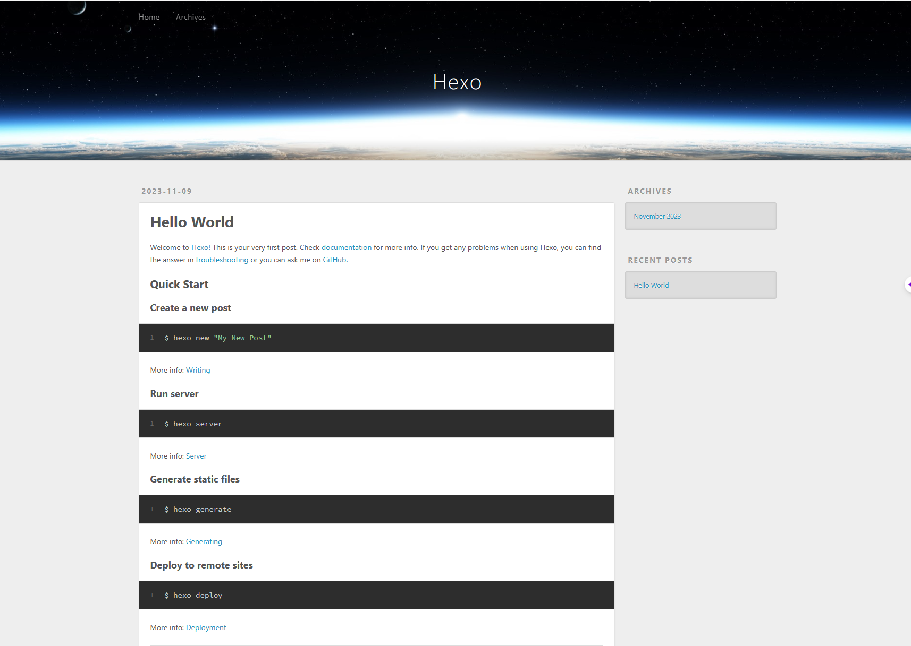

**注**：在`Git Bash`窗口中点击`Ctrl`+`C`即可停止预览

### 将博客推送到远程仓库

在此之前还需要先安装一点儿插件帮助我们，输入：
```shell
npm install hexo-deployer-git
```
```shell
npm install hexo-generator-feed
```
如果没有报错，即安装成功

接着打开博客文件下的`_config.yml`文件，修改`deploy`配置为：
```yml
deploy:
    type: git
    repo: git@github.com:你的GitHub用户名/你的Github用户名.github.io.git
    branch: main
```
实际上，`repo`即远程仓库的意思，这个对应的就是我们创建的个人博客仓库

示例：

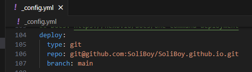

保存文件修改，并在`Git Bash`窗口中输入 ：
```shell
hexo d
```
没有报错即推送成功：

<br> 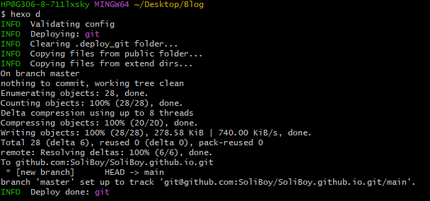

接着再到`GitHub`上看一看我们的博客仓库，会发现已经上传了文件：

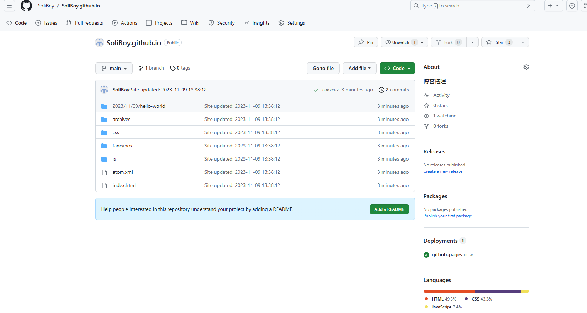

看一看`Actions`，也部署成功了 ：

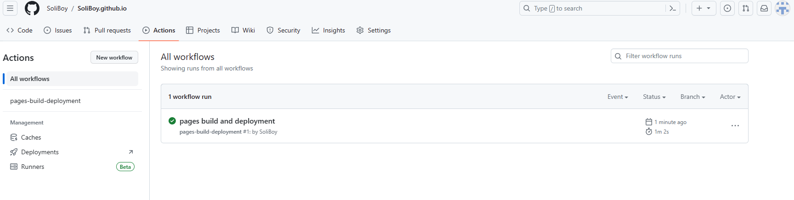

然后再在浏览器中输入地址
```
https://你的用户名.github.io
```
即可访问你的博客站点啦(同理别人亦可访问) ：

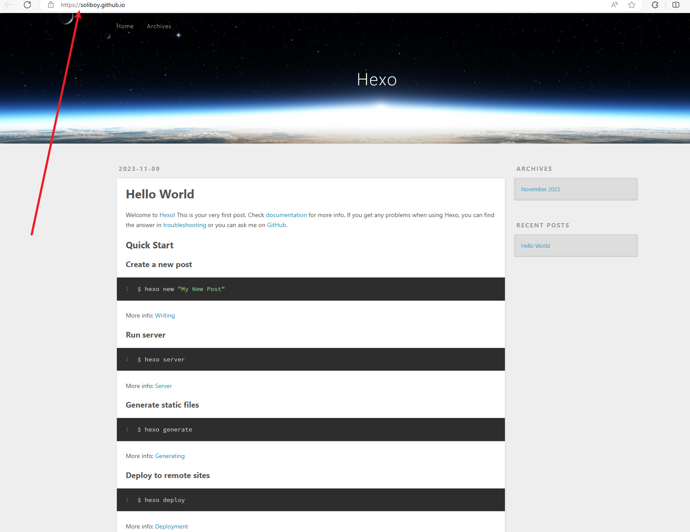

至此，基本的工作已经完成，可以开始写博客~~水文~~了:yum:

## 使用

先贴一下[Hexo中文官网](https://hexo.io/zh-cn/index.html)，大家可以上去仔细看看`Hexo`的详细使用和说明

### 撰写博文

首先，将`_config.yml`中的`post_asset_folder`设为`true`:

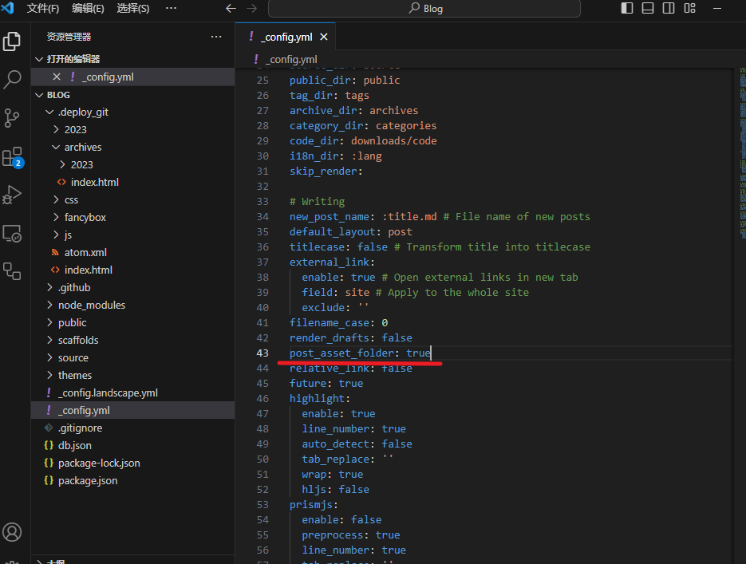

这个配置可以在你新建博文的时候自动生成一个对应文件夹(可以用来存放媒体文件) 

然后在博客项目中打开`Git Bash`，输入 ：
```shell
hexo new 博文的文件名 #不要带.md
```
示例：

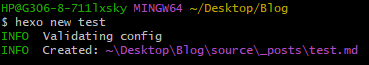

然后打开打印信息中对应的路径，就会看到新生成的`markdown`文件和对应的文件夹 ：

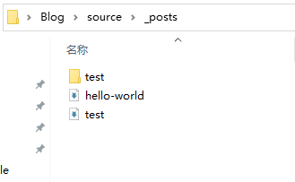

现在你可以尝试在媒体文件夹中放张图，博文中引一下，再写一写公式、`emoji`之类的，然后试着推送一下

**注**：每次推送，使用指令：
```shell
hexo cl #清除缓存
hexo g #生成页面
hexo d #推送远程
```
三条指令即可，且需要按照顺序

### 配置优化

嘿嘿，你可能会发现推送没问题，但是图片/公式/表情没法显示，这时候就需要来一些优化操作

由于每个人的偏好可能都不一样，所以这里并不会给出教程。大家遇到实际问题之后可以去查一查或者问问。

### 个性化

#### 主题更换

`Hexo`官网上就有很多主题推荐： [主题列表](https://hexo.io/themes/)

这里的配置就比较多了，大家可以根据自己的需要去看一看找一找，教程也有很多。建议大家可以换一换，不少主题比较好看而且可以修复一些默认主题下的问题。

我这里试了下`fluid`主题，换主题之后：

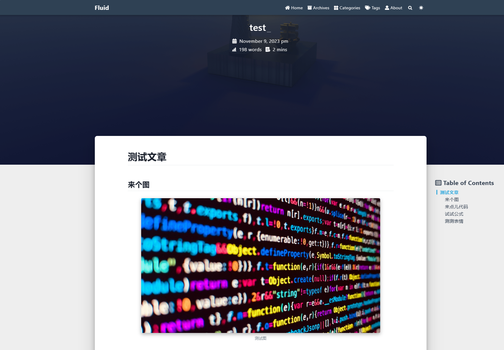

给个链接：[fluid官方文档](https://hexo.fluid-dev.com/docs/start/)
