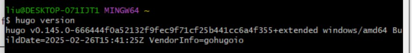

# Hugo + Vercel 搭建个人博客

什么是个人博客？

个人博客是一个由个人维护的、纯看个人兴趣的网站，用于分享个人的观点、经验、知识或者生活。

相比于公共博客，它的优势包括高度的自由度和个性化，它是极客的个人名片，也是个有点小众的交友平台。

**注意**：如果下述的任一步骤你已经自行完成，就不需要**重复劳动**啦！

## 工具介绍

1. **VSCode**：一个免费、开源的代码编辑器，支持多种编程语言和开发工具，并拥有丰富的扩展生态系统。
2. **Git**：一个分布式版本控制系统，用于跟踪和管理项目中的文件更改。
3. **Hugo**：被广泛认为是世界上生成网页速度最快的静态博客生成器。

## 网站介绍

1. **GitHub**：一个基于 Git 版本控制系统的在线平台，它允许开发者**托管**、协作和管理他们的代码仓库。
2. **Vercel**：一个面向前端开发者的平台，提供网站托管、部署和服务器端渲染等服务。

## 知识点介绍

1. Git 和 GitHub 的使用，本课堂仅涉及 Hugo 项目需要的部分
2. Vercel 自动部署的使用
3. Hugo 指令的部分使用方法
4. Markdown 语法，由于时限原因，需要同学们完成自学，这部分并不难学。

## 环境准备

考虑到大家基本都是使用`Windows`系统，本课程也以`Windows`环境为例。

### VSCode

#### 1.下载

官方网址：[https://code.visualstudio.com/](https://code.visualstudio.com/)

点击网站右上角的 Download（**而不是**页面中间的 Download）。


点击`System Installer`右边的`x64`（如果你的电脑是`ARM`架构，那就点`Arm64`，如果不清楚，那就`x64`）。

之后等待几秒，下载会自动开始。


#### 2.安装

打开下载的安装包，只需在一个界面注意一下，其他都直接点下一步：


保证上图的所有的 ✅ 都被打上后，一直点击下一步，直到安装结束。

运行刚刚安装完成的 VSCode，如图点击到`扩展`页面，箭头所指的地方就是搜索社区扩展的地方：


该项目推荐安装以下插件：

- Chinese (Simplified) (简体中文) Language Pack for Visual Studio Code
- Even Better TOML
- Material Icon Theme 或者 vscode-icons

安装完成后可以先关闭 VSCode。

### Git 与 GitHub

#### 1.Git 的下载与安装

官方网址：[https://git-scm.com/](https://git-scm.com/)

点击网页右边的`Download For Windows`，按图所示点击链接开始下载：


只需要注意两个页面，其他一直点击`Next`即可：

下图的`On the Desktop`是在桌面上创建 2 个快捷方式，根据自己的喜好可点可不点。


#### 3.检查安装

安装完成后，按下你的`Win`键，直接输入`git bash`，如果软件可以被找到，那说明安装成功了。

#### 4.注册 GitHub 账号

进入`GitHub`官网：[https://github.com/](https://github.com/)


点击页面右上角的注册，使用自己的邮箱进行注册即可。

#### 5.配置 Git

##### 本地 Git 配置

按下你的`Win`键，直接输入`git bash`，然后按下回车，依次输入下面两行命令（**注意引号不能去掉，并且是英文引号**）：

```bash
git config --global user.name "你的github用户名"
git config --global user.email "你在github上注册用的邮箱"
```

输入下面这行命令可以检查刚才设置的信息：

```bash
git config --global --list
```


##### 通过 SSH 链接本地与远程 GitHub

继续在`Git Bash`中输入：

```bash
ssh-keygen -t rsa -C "你在github上注册用的邮箱"
```

之后一直回车即可，效果如下：


然后依次输入：

```bash
cd ~/.ssh       #进入.ssh目录
ls              #查看当前文件下文件
cat id_rsa.pub  #将目标文件的内容输出
```

将最后一行命令输出的公钥（**包括开头的`ssh-rsa`和结尾的`邮箱地址`**）整个复制下来：


回到 github 页面，点击在网站右上角的你的头像，点击`Your profile`，进入到账户信息页面。

按照图中所示，依次点击`SSH and GPG keys`和`New SSH Key`：


进入提交公钥的界面：


其中，`Title`随便取，`Key Type`保持默认，`Key`里面粘贴你刚刚复制下来的公钥，最后单击`Add SSH Key`。

回到`Git Bash`，输入：

```bash
ssh -T git@github.com
```

出现以下提示即`SSH`连接成功（注意这里第一次连接可能需要键入`yes`，按提示操作即可）：


##### 错误排查

有些同学在最后一步可能会出现`Connection closed by ...`的提示。

在公钥正确提交的前提下，这可能是代理服务器的干扰造成的，可以尝试使用通过 HTTPS 端口建立的 SSH 连接克隆。

要测试通过 HTTPS 端口的 SSH 是否可行，请运行以下 SSH 命令：

```bash
ssh -T -p 443 git@ssh.github.com
```

如果这行命令有效，解决方案请参考：[在 HTTPS 端口使用 SSH](https://docs.github.com/zh/authentication/troubleshooting-ssh/using-ssh-over-the-https-port#enabling-ssh-connections-over-https)

如果无效，请检查公钥是否正确提交。

### Hugo

对于在 Windows 上安装`Hugo`，官方给出了多种办法，这里采用最简单快速的、Windows10 和 11 系统自带的`winget`包管理器安装方法。

继续在`Git Bash`中输入：

```bash
winget install Hugo.Hugo.Extended
```


由于我是卸载再安装，所以同学们可能和我显示的内容不太一样，只要按照操作进行下去即可。

安装完毕后，建议重启一下`Git Bash`，然后输入：

```bash
hugo version
```



如果你的输出也如上图一般显示，那么说明`Hugo`已经被安装成功了。

### Vercel

网站链接：[https://vercel.com/](https://vercel.com/)

点击右上角进行注册，昵称自取：


点击`Continue`后，点击`Continue with GitHub`。

之后可能会要你的手机号，把国家改成`China`后正常填写即可。

如果出现了类似于下图的界面，说明你注册成功了。


## 正式开始

### 新建 Hugo 项目

选择一个你中意的文件夹，在文件夹处右键，在此处打开`git bash`，输入指令：

```bash
hugo new site my_blog # "my_blog"可以自行替换
```

等待跳出提示，你的 Hugo 博客就完成了第一步——创建。

我们先初步瞥一眼各个项目的作用
```bash
.
├── archetypes       # 存放定义新内容的模板
│   └── default.md   # 新生成的文章文件的模板
├── assets           # 存放需要 Hugo 处理的资源
├── content          # 存放文章 Markdown 格式文件（重要！）
├── data             # 存放网站的一些数据
├── i18n             # 存放网站的国际化文件
├── layouts          # 存放网站代码
├── static           # 存放静态资源（重要！）
├── themes           # 存放主题（重要！）
└── hugo.toml        # 主要配置文件（重要！）
```
现在我们来看 hugo 给的提示：

```bash
1. Change the current directory to ./my_blog.
2. Create or install a theme:
   - Create a new theme with the command "hugo new theme <THEMENAME>"
   - Or, install a theme from https://themes.gohugo.io/
3. Edit hugo.toml, setting the "theme" property to the theme name.
4. Create new content with the command "hugo new content <SECTIONNAME>/<FILENAME>.<FORMAT>".
5. Start the embedded web server with the command "hugo server --buildDrafts".
```

我们先照着它说的做，在`bash`中敲入以下指令：

```bash
cd my_blog
hugo new theme my_theme # "my_theme"可自取名字，如果你不是要自研出新的theme，那这不重要
```

然后自行修改项目根目录下的`hugo.toml`，在文件中另起一行，加入：

```toml
theme = 'my_theme' # 表示博客选用的主题名称
```

最后敲入命令：

```bash
hugo new content posts/my_first.md  # 新建名为my_first的文章
hugo server -D  # -D 与 --buildDrafts 等价
```

现在，你的博客就在本地运行起来了，在浏览器中打开`hugo server -D`输出的地址，可以看到一个最基本的、没有任何装饰的网站。

这肯定不是你想要的，所以现在我们首先要做的，是为博客找一个你中意的主题。

### 寻找合适的主题

搜索引擎搜索：`hugo theme`，或者在网址栏输入：[https://themes.gohugo.io/](https://themes.gohugo.io/)。进入到 Hugo 主题列表的页面。

这里有很多供你挑选的主题，每个主题的配置方式都有所区别，如果你要应用某个主题，**万万记得要看主题的作者给的文档。如果你在遇到问题时恰逢主题的文档不全，或者 exampleSite 不清晰，请果断更换主题，除非你有精力去学 Hugo Theme 的开发且愿意花时间去读主题的源码。**

为了教学方便，这里选择一个自用主题*Changle-Scape*。

此处将用到`git`的一个关键指令：

```bash
git clone <repository_URL>
# 作用是将远程服务器上的仓库克隆到本地
```

#### 获得仓库的地址

打开 github 的仓库界面，点击界面右上角的绿色的`Code`按钮，刚才我们完成了 SSH 本地与 github 的链接，所以我们可以点击`SSH`（实际上 HTTPS 和 SSH 都可以），点击 URL 右边的复制按钮。


#### 克隆到本地

我们要把主题克隆到 themes 文件夹内，所以执行指令：

```bash
git clone git@github.com:ChangleCat/Changle-Scape.git themes/Changle-Scape
# 最后的参数表示clone的目的地，如果为空则是保存在当前目录下的一个新文件夹里
```

进入到`Changle-Scape`文件夹内，可以看到项目结构：
```bash
.
├── .vscode          # vscode 配置文件
├── archetypes
├── assets
├── content
├── exampleSite      # 主题使用案例（重要！）
├── layouts
├── static           
├── theme.toml       # 主题配置文件
├── .gitignore       # 保存应该被git忽略的文件(夹)的文件
└── 其他文件          # 暂且不用管
```

这时候我们发现